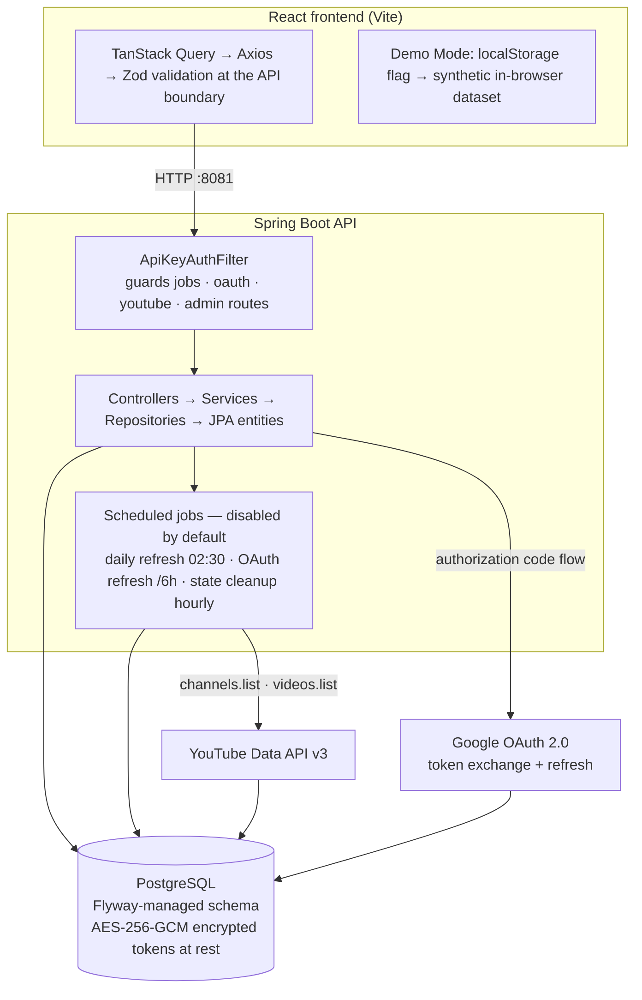

# SocialLens

Ingest public YouTube channel and video metrics, snapshot them once per day, and read the resulting time series in a React dashboard.

The interesting problem here is not the charts — it is making a daily metrics pipeline **idempotent and quota-aware** on top of an API that only ever tells you the current value. SocialLens solves that with day-keyed upserts, a cursor-based incremental video sync, and a per-channel concurrency guard.

> **Scope:** local-first prototype, run with Docker + a YouTube Data API key. Single user, no authentication, not deployed.
> Spring Boot 3.3.0 (Java 17) · React 18 + TypeScript · PostgreSQL + Flyway.

---

## Quick Demo (no backend required)

SocialLens ships with a **Demo Mode**: a **synthetic, browser-local dataset**. No backend, database, or API key is involved, and none of the numbers are real.

1. Open `http://localhost:5173` (frontend only).
2. Click **Demo** in the top-right toolbar.
3. All pages (dashboard, channel detail, videos, trends) switch to the synthetic dataset.
4. An amber **"Demo"** badge and a persistent banner mark the data as not real.
5. Click **Demo** again to return to live mode.

This is the fastest way to walk through the UI without provisioning credentials.

---

## What It Does

SocialLens lets you:

- **Track channels** — look up any public YouTube channel by ID, handle, or custom URL
- **Snapshot metrics daily** — subscriber count, view count, and video count stored at most once per day per channel, via a manual refresh or the (opt-in) scheduled job
- **Explore trends** — visualise timeseries data (7 / 30 / 90-day range) with daily-change or cumulative modes
- **Browse videos** — paginated, sortable table of synced videos with per-video stats (views, likes, comments)
- **Connect via OAuth** — link a Google/YouTube account via the authorization code flow; access token is auto-refreshed before expiry
- **Trigger manual refreshes** — hit the jobs API to refresh a specific channel on demand

---

## Tech Stack

### Backend

| Layer           | Technology                                                        |
| --------------- | ----------------------------------------------------------------- |
| Framework       | Spring Boot 3.3.0, Java 17                                        |
| Data            | Spring Data JPA / Hibernate, Flyway, PostgreSQL                   |
| API integration | YouTube Data API v3 (REST, key-based)                             |
| OAuth           | Google OAuth 2.0 — authorization code flow                        |
| Security        | AES-256-GCM token encryption, API key guard on admin endpoints    |
| Scheduling      | Spring `@Scheduled` with configurable cron expressions            |
| Build           | Gradle                                                            |
| Testing         | JUnit 5, Mockito, `@AutoConfigureMockMvc`                         |
| Docs            | springdoc-openapi (Swagger UI at `/swagger-ui.html`)              |

### Frontend

| Layer        | Technology                                                              |
| ------------ | ----------------------------------------------------------------------- |
| Framework    | React 18 + TypeScript (strict mode), Vite                               |
| Server state | TanStack Query v5                                                       |
| HTTP         | Axios + Zod schema validation at API boundary                           |
| Charts       | Recharts                                                                |
| UI           | shadcn/ui (Radix primitives) + Tailwind CSS + CSS variable token system |
| Motion       | Framer Motion (page/panel transitions only)                             |
| Icons        | Lucide React                                                            |
| Fonts        | Syne (display) + Instrument Sans (body) + DM Mono (all numerics)        |
| Testing      | Vitest + @testing-library/react                                         |

---

## Architecture Overview



**Ingestion path:** a refresh run resolves each tracked channel against the YouTube Data API, writes one snapshot row per channel per day via an idempotent upsert (`UNIQUE(channel_id, captured_day_utc)`, so a duplicate is a no-op), and advances a `lastVideoSyncAt` cursor so only new videos are fetched. A `ConcurrentHashMap` lock plus `SyncCooldownGuard` prevents the same channel from syncing twice concurrently.

**Scheduling is off by default.** `sociallens.jobs.enabled`, `daily-refresh.enabled`, and `oauth-refresh.enabled` all ship as `false`; out of the box, snapshots are produced only by a manual `POST /api/v1/jobs/refresh/channel`. Enable them in `application-local.properties` to run the cron schedules (daily refresh `0 30 2 * * *`, OAuth refresh every 6 h, OAuth state cleanup hourly), which also apply per-run caps of 25 channels / 500 API calls / 400 videos per channel.

See [docs/architecture.md](docs/architecture.md) for the full design.

---

## Getting Started

### Prerequisites

- Java 17+
- Node.js 18+
- Docker (for PostgreSQL)
- A [YouTube Data API v3 key](https://console.cloud.google.com/)
- (Optional, for OAuth) A Google OAuth 2.0 client configured with the redirect URI below

### 1. Clone

```bash
git clone https://github.com/AruruGunabhiram/SocialLens.git
cd SocialLens
```

### 2. Configure environment variables

Copy the example file and fill in your values:

```bash
cp backend/src/main/resources/application-local.properties.example \
   backend/src/main/resources/application-local.properties
```

Required keys in `application-local.properties`:

```properties
sociallens.admin.api-key=your-secret-admin-key

youtube.api.key=AIza...
google.oauth.client-id=...apps.googleusercontent.com
google.oauth.client-secret=...
google.oauth.redirect-uri=http://localhost:8081/api/v1/oauth/youtube/callback

sociallens.security.token-encryption-key=replace-with-a-long-random-secret

# PostgreSQL (matches docker-compose.yml defaults)
spring.datasource.url=jdbc:postgresql://localhost:5432/sociallens
spring.datasource.username=sociallens
spring.datasource.password=sociallens
```

> **Note:** Never commit `application-local.properties`. It is gitignored.

### 3. Start PostgreSQL

```bash
docker compose up -d db
```

This starts `sociallens-postgres` on port 5432. Flyway applies `V1__baseline.sql` automatically on first boot.

### 4. Start the backend

```bash
cd backend
./gradlew bootRun --args='--spring.profiles.active=local'
```

The API starts on **port 8081**. On first boot with `sociallens.seed.enabled=true`, the backend auto-syncs `@mkbhd` if the channel table is empty.

### 5. Start the frontend

```bash
cd frontend
npm install
npm run dev
```

The dev server starts on **port 5173**. Open `http://localhost:5173`.

### 6. Sync a channel (optional if seed is enabled)

```bash
curl -X POST "http://localhost:8081/api/v1/youtube/sync" \
  -H "Content-Type: application/json" \
  -H "X-API-Key: your-secret-admin-key" \
  -d '{"identifier": "@mkbhd"}'
```

---

## Demo Flow (portfolio walkthrough)

This sequence shows the full feature set in ~5 minutes using demo mode — no backend required.

1. **Enable Demo Mode** — click the **Demo** button in the toolbar. An amber badge confirms mock data is active.
2. **Dashboard** — shows channel health cards with subscriber counts, view trends, and freshness badges.
3. **Channel Detail** — click any channel → Overview tab shows current stats; switch to the Videos or Trends tab.
4. **Videos Tab** — sort by views, likes, or comments; search by title or video ID; paginate through results.
5. **Trends Tab** — switch metric (Views / Subscribers / Uploads), change range (7 / 30 / 90 days), toggle daily-change vs. cumulative mode. Insight cards show peak, average, and trend direction.
6. **Freshness Badge** — hover the badge on any channel card to see last sync time and refresh status.
7. **OAuth Connect** (live mode only, requires backend) — click **Connect YouTube** in the sidebar to start the Google OAuth flow in a new tab. On success the sidebar updates to show the connected account status.
8. **Manual Refresh** — after connecting, use the Re-sync button on a channel detail page to trigger an on-demand refresh.

---

## Key Features

### Daily Snapshot Strategy

A `DailyRefreshJob` (cron: `0 15 3 * * *`, 3:15 AM UTC, configurable via `sociallens.jobs.daily-refresh.cron`) fetches public metrics for every active channel and writes a `channel_metrics_snapshot` row per day. A `UNIQUE(channel_id, captured_day_utc)` constraint enforces exactly one snapshot per channel per UTC day — duplicate insertions are caught as `DataIntegrityViolationException` and silently ignored, making the job naturally idempotent.

Jobs are **disabled by default** (`sociallens.jobs.enabled=false`). Enable them per-environment via `application-local.properties`.

### Timeseries Analytics

- Query: `GET /analytics/timeseries/by-id?channelDbId={id}&metric=VIEWS&rangeDays=30`
- Range calculation: `today − (rangeDays − 1)` so a 30-day range always includes today.
- Frontend: TrendsPage with metric / range / mode selectors, Recharts `LineChart`, and insight cards (peak, avg, trend direction).

### OAuth & Token Security

Users connect their YouTube account via Google OAuth 2.0 (authorization code flow). State tokens are single-use UUIDs with a 10-minute TTL stored in the `oauth_states` table. Access and refresh tokens are encrypted at rest using **AES-256-GCM** (12-byte random IV per write, `enc:v1:` prefix, key validated at startup). The `YouTubeOAuthService` auto-refreshes the access token within 60 seconds of expiry. A background `OAuthAnalyticsRefreshJob` (every 6 hours) proactively refreshes tokens for all active accounts.

### Incremental Video Sync

Videos are fetched via the channel's uploads playlist with a `lastVideoSyncAt` cursor on `YouTubeChannel`. Each run only fetches videos published after the cursor, keeping API cost proportional to actual activity rather than total channel history.

### Per-channel Sync Safety

`DailyRefreshWorker` uses a `ConcurrentHashMap` lock per channel to prevent concurrent syncs of the same channel. A `SyncCooldownGuard` (30-second default cooldown) prevents hammering a channel with rapid manual refresh requests, returning `429 rate_limited` if triggered too quickly.

### Admin API Key Guard

`/api/v1/jobs/**`, `/api/v1/connected-accounts/**`, `/api/v1/creator/**`, `/api/v1/youtube/**`, and `/api/v1/admin/**` all require an `X-API-Key` header matching `sociallens.admin.api-key`. Two paths are intentionally public: `/api/v1/connected-accounts/status` (polled by the frontend every 10 s) and `/api/v1/jobs/refresh/channel` (manual trigger from the UI).

---

## API Reference

Base URL: `http://localhost:8081`

Full interactive docs: `http://localhost:8081/swagger-ui.html`

### Channels

| Method | Path                                            | Auth       | Description               |
| ------ | ----------------------------------------------- | ---------- | ------------------------- |
| `GET`  | `/channels`                                     | Public     | List all tracked channels |
| `GET`  | `/channels/{channelDbId}`                       | Public     | Channel detail + metadata |
| `GET`  | `/channels/{channelDbId}/videos?page=0&size=20` | Public     | Paginated videos          |

### Analytics

| Method | Path                                                                 | Auth   | Description                                                         |
| ------ | -------------------------------------------------------------------- | ------ | ------------------------------------------------------------------- |
| `GET`  | `/analytics/channel/by-id?channelDbId=`                              | Public | Current metrics (subs, views, videos)                               |
| `GET`  | `/analytics/timeseries/by-id?channelDbId=&metric=VIEWS&rangeDays=30` | Public | Timeseries points (`metric`: `VIEWS` \| `SUBSCRIBERS` \| `UPLOADS`) |
| `GET`  | `/analytics/videos/by-id?channelDbId=&limit=10`                      | Public | Top videos by view count                                            |
| `GET`  | `/analytics/upload-frequency/by-id?channelDbId=&weeks=12`            | Public | Upload frequency breakdown                                          |

> Identifier-based variants (`?identifier=UCxxx` or `?identifier=@handle`) are supported for all analytics endpoints.

### OAuth

| Method | Path                                                  | Auth   | Description                                      |
| ------ | ----------------------------------------------------- | ------ | ------------------------------------------------ |
| `GET`  | `/api/v1/oauth/youtube/start?userId=`                 | Public | Returns Google OAuth consent URL                 |
| `GET`  | `/api/v1/oauth/youtube/callback?code=&state=`         | Public | Exchange code for tokens (Google redirects here) |

### Connected Accounts

| Method   | Path                                    | Auth     | Description                        |
| -------- | --------------------------------------- | -------- | ---------------------------------- |
| `GET`    | `/api/v1/connected-accounts/status`     | Public   | Check current OAuth connection     |
| `GET`    | `/api/v1/connected-accounts/detail`     | API Key  | Full account detail                |
| `DELETE` | `/api/v1/connected-accounts/disconnect` | API Key  | Revoke token and disconnect        |

### Jobs

| Method | Path                                         | Auth    | Description                          |
| ------ | -------------------------------------------- | ------- | ------------------------------------ |
| `POST` | `/api/v1/jobs/refresh/channel?channelDbId=`  | Public  | Trigger manual channel refresh       |
| `GET`  | `/api/v1/jobs/budget`                        | Public  | Current API quota usage              |

### YouTube (channel add / re-sync)

| Method | Path                   | Auth    | Description                            |
| ------ | ---------------------- | ------- | -------------------------------------- |
| `POST` | `/api/v1/youtube/sync` | API Key | Add or re-sync a channel by identifier |

---

## Project Structure

```
SocialLens/
├── backend/
│   ├── src/main/java/com/LogicGraph/sociallens/
│   │   ├── SocialLensApplication.java
│   │   ├── config/              # SecurityConfig, CorsConfig, YouTubeApiConfig,
│   │   │                        # TokenEncryptionConfig, SchedulerConfig
│   │   ├── controller/          # AnalyticsController, ChannelsController,
│   │   │                        # YouTubeOAuthController, JobsController,
│   │   │                        # ConnectedAccountController, YouTubeController
│   │   ├── service/
│   │   │   ├── analytics/       # AnalyticsServiceImpl
│   │   │   ├── youtube/         # YouTubeServiceImpl, YouTubeSyncServiceImpl
│   │   │   ├── oauth/           # YouTubeOAuthService, GoogleTokenService,
│   │   │   │                    # GoogleTokenRevoker
│   │   │   ├── channel/         # ChannelsServiceImpl, ChannelVideosServiceImpl
│   │   │   ├── resolver/        # DefaultChannelResolver
│   │   │   └── creator/         # RetentionDiagnosisServiceImpl (partial)
│   │   ├── security/            # TokenCrypto (AES-256-GCM), EncryptedTokenConverter,
│   │   │                        # ApiKeyAuthFilter
│   │   ├── repository/          # JPA repositories
│   │   ├── entity/              # YouTubeChannel, YouTubeVideo, ChannelMetricsSnapshot,
│   │   │                        # VideoMetricsSnapshot, ConnectedAccount, OAuthState, User
│   │   ├── dto/                 # Organised by domain: analytics/, channels/, oauth/, ...
│   │   ├── jobs/                # DailyRefreshJob, DailyRefreshWorker,
│   │   │                        # OAuthAnalyticsRefreshJob, OAuthStateCleanupJob,
│   │   │                        # ApiCallBudget, SyncCooldownGuard, JobProperties
│   │   ├── enums/               # Platform, RefreshStatus, DataSource, ConnectedAccountStatus
│   │   └── exception/           # Domain exceptions + GlobalExceptionHandler
│   ├── src/main/resources/
│   │   ├── application.properties
│   │   ├── application-local.properties.example
│   │   └── db/migration/        # V1__baseline.sql, V2__add_snapshot_indexes.sql,
│   │                             # V3__constraints.sql
│   └── src/test/                # Controller, service, and repository tests
│
└── frontend/
    └── src/
        ├── api/                 # axiosClient, endpoints, schemas (Zod), httpError
        ├── app/                 # App.tsx, router.tsx, providers.tsx, queryClient.ts
        │   └── layout/          # AppShell, Sidebar, Topbar
        ├── components/
        │   ├── ui/              # shadcn primitives (Radix-based)
        │   ├── common/          # MetricCard, ChartCard, DataTable, EmptyState, ErrorState
        │   └── charts/          # Sparkline, RangePills
        ├── features/
        │   ├── channels/        # ChannelsListPage, ChannelOverviewPage, queries.ts
        │   ├── trends/          # TrendsPage, computeInsights, hasSufficientData
        │   ├── account/         # OAuth connect/disconnect, useAccountStatus
        │   └── videos/          # VideosPage
        ├── lib/                 # format.ts, utils.ts, toast.ts, demoData.ts
        ├── pages/               # DashboardPage, OAuthCallbackPage, NotFoundPage
        └── styles/              # tokens.css, base.css, animations.css
```

---

## Implemented vs. Planned

### What is fully implemented

- Public channel tracking by handle, ID, or custom URL
- Daily snapshot pipeline with idempotent upsert (scheduler disabled by default; runs on manual refresh)
- Incremental video sync with `lastVideoSyncAt` cursor
- Per-channel concurrent sync guard (`ConcurrentHashMap` lock + `SyncCooldownGuard`)
- AES-256-GCM token encryption at rest (all OAuth tokens)
- Google OAuth 2.0 authorization code flow — start, callback, state validation (single-use UUID, 10-min TTL), token exchange
- Automatic access token refresh (60-second pre-expiry buffer)
- Background OAuth token refresh job (every 6 hours; disabled by default)
- Expired OAuth state cleanup job (every hour, top of the hour UTC)
- Timeseries analytics (7 / 30 / 90 days, three metrics)
- Paginated, sortable, searchable video table
- Admin API key guard on management endpoints
- Frontend Demo Mode with full in-memory dataset
- Loading, empty, and error states on all pages
- Human-readable error messages via `normalizeHttpError` + `humanizeError`
- Freshness badge reflecting real backend refresh status and timestamp
- `FreshnessBadge` reads `lastRefreshStatus`, `lastSuccessfulRefreshAt`, `snapshotDayCount`

### Partially implemented (backend exists, frontend or wiring incomplete)

| Feature | What works | What's missing |
|---------|-----------|----------------|
| OAuth disconnect | Backend endpoint exists (`DELETE /connected-accounts/disconnect`) | Requires `X-API-Key` header — browser cannot call it directly without the admin key |
| API quota tracking | `ApiCallBudget` bean with daily counter and midnight reset | `decrement()` is never called during refresh — remaining count stays at 10,000 |
| Connected account status transitions | `ACTIVE` and `DISCONNECTED` are written in production | `REFRESH_FAILED`, `EXPIRED`, `REVOKED` transitions are never triggered |
| `lastRefreshedAt` on connected accounts | Field and getter exist on entity | Never written — always `null` in production |
| Creator Intelligence / Retention Diagnosis | `RetentionDiagnosisServiceImpl` classifies retention drops | No frontend page; endpoint at `POST /api/v1/creator/retention/diagnosis` |
| YouTube Analytics API (private data) | `YtAnalyticsService` and `YtAnalyticsController` exist | Not called by any frontend route; dead backend path |

### Not implemented

- User authentication (JWT, login/signup) — all data endpoints are currently public
- Per-video trend charts (snapshots are written, no frontend page)
- Instagram integration (`Platform.INSTAGRAM` enum exists; no API or OAuth)
- Export to CSV
- Multi-user / team access
- HTTPS / production hardening

---

## Known Limitations

1. **No user authentication.** All channel and analytics endpoints are open. Anyone who can reach port 8081 can read all data. The `User` entity and `ConnectedAccount` storage exist, but JWT enforcement is not implemented.

2. **Single-user model.** The UI has no login/signup flow. OAuth linkage uses a hardcoded `userId=1` from `UserService.getOrCreateDefaultLocalUser()`.

3. **Disconnect button does not work from the browser.** `DELETE /api/v1/connected-accounts/disconnect` requires an `X-API-Key` header. The frontend does not send this header (admin keys must not be embedded in the browser bundle), so the request returns 403. Disconnect currently requires a direct `curl` call with the admin key.

4. **API quota tracking is inert.** `ApiCallBudget` exists and resets at midnight UTC, but `decrement()` is never called during refresh. The budget always reports 0 used / 10,000 remaining regardless of actual API calls made.

5. **`DailyRefreshJob` can overlap with a manual trigger.** The per-channel `ConcurrentHashMap` lock prevents concurrent syncs of the same channel, but there is no whole-job lock — the scheduled job and a manual `/jobs/refresh/channel` call can run concurrently for different channels.

6. **OAuth token refresh status is not propagated to UI.** `REFRESH_FAILED`, `EXPIRED`, and `REVOKED` status values exist in the `ConnectedAccountStatus` enum but are never written in production. The OAuth refresh job catches all exceptions without updating account status, so a silently broken refresh is indistinguishable from a healthy one.

7. **`lastRefreshedAt` is never written.** The field exists on `ConnectedAccount` and is exposed in the status DTO, but `updateTokens()` and the refresh path never set it. It will always return `null`.

8. **PostgreSQL required locally.** Local dev requires PostgreSQL via `docker-compose.yml`. Tests use H2 in-memory with Flyway disabled.

9. **YouTube private analytics not surfaced in the UI.** Only publicly available metrics (subscriber count, view count, video count) are shown. YouTube Analytics API data (watch time, revenue, traffic sources) requires OAuth with the channel owner's consent. The backend `YtAnalyticsService` exists but is not connected to any live frontend route.

10. **No HTTPS or production hardening.** No TLS config, no secret rotation. Suitable for local dev and portfolio demonstration only.

---

## Testing & Verification

| | |
|---|---|
| Backend | 21 JUnit 5 test classes (Mockito, `@AutoConfigureMockMvc`, H2 in-memory with Flyway disabled) |
| Frontend | 16 Vitest / Testing Library test files |
| CI | GitHub Actions — frontend: typecheck, lint, unit tests, production build; backend: Gradle build and test |

Test counts are file counts from this repository. CI status is not asserted here; run the workflow to confirm.

**Smoke check a running stack:**

```bash
curl -s http://localhost:8081/health                       # expect: OK
curl -X POST "http://localhost:8081/api/v1/jobs/refresh/channel?channelDbId=1"   # expect: 200 + refresh JSON

# Admin guard: no key -> 401, valid key -> 200
curl -s -o /dev/null -w "%{http_code}\n" http://localhost:8081/api/v1/youtube/sync
curl -X POST "http://localhost:8081/api/v1/youtube/sync" \
  -H "Content-Type: application/json" -H "X-API-Key: $SOCIALLENS_ADMIN_KEY" \
  -d '{"identifier": "@mkbhd"}'
```

In the UI, toggling **Demo** switches every page to the synthetic dataset and shows an amber badge; stopping the backend flips the footer indicator from **Operational** to **Degraded** within roughly one 60 s polling interval.

---

## License

MIT
